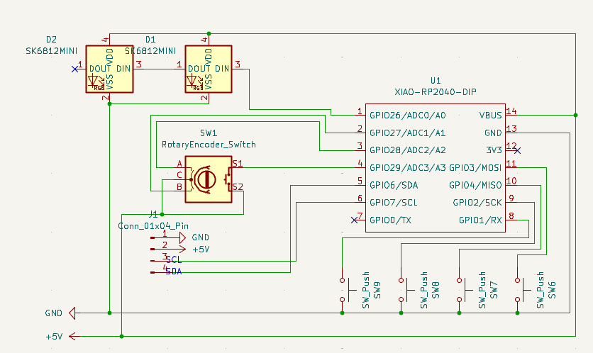
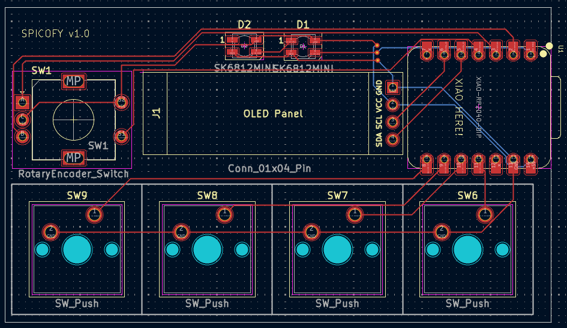
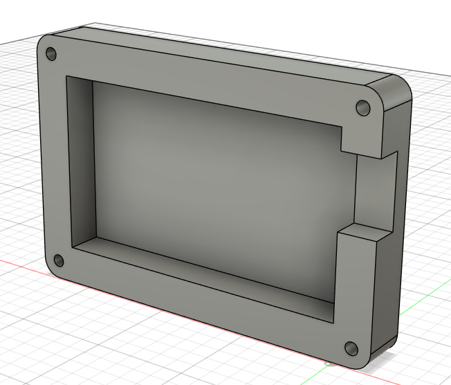

# **Spicofy**
**Version**: `1.0`
 

A spotify controller with features including play, pause and volume control and an OLED Panel to show the currently playing song along with RGB indicators for status.
 

Made as a submission to [hackclub's blueprint](blueprint.hackclub.com) with immense help from the [make-your-own-hackpad guide.](https://blueprint.hackclub.com/hackpad)

> *This is my first hardware project! Thank you hackclub for this amazing opportunity!! <3*

## Components Used
- Seeed XIAO RP2040 (1x)
- EC11 Rotary encoder (1x)
- MX-Style switches (4x)
- SSD1306 0.91 inch OLED display (1x)
- SK6812 MINI-E LEDs (2x)

## Pictures
> Taken from [Fusion 360](https://www.autodesk.com/products/fusion-360/overview) & [KiCad](https://www.kicad.org/)

> Model Credits (grabcad.com)
> - [cherry-mx-switches](https://grabcad.com/library/cherry-mx-switches-mx-1)
> - [seeed-studio-xiao-rp2040](https://grabcad.com/library/seeed-studio-xiao-rp2040-2)
> - [SSD1306-oled-display](https://grabcad.com/library/display-oled128x32-1)
> - [rotary-encoder](https://grabcad.com/library/rotary-encoder-17)
> - [sk6812mini-e-led](https://grabcad.com/library/sk6812mini-e-led-1)