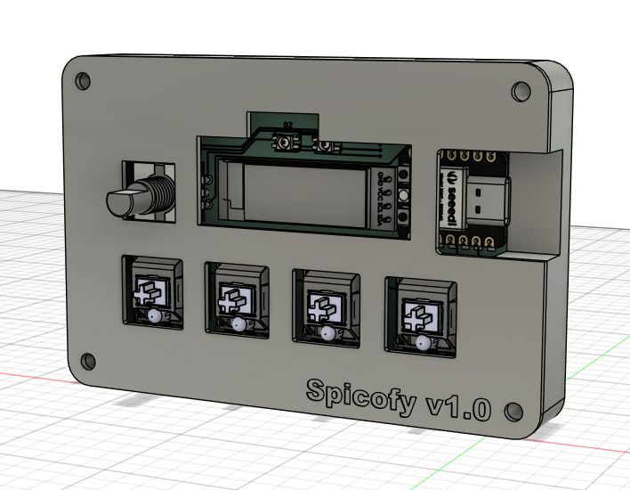
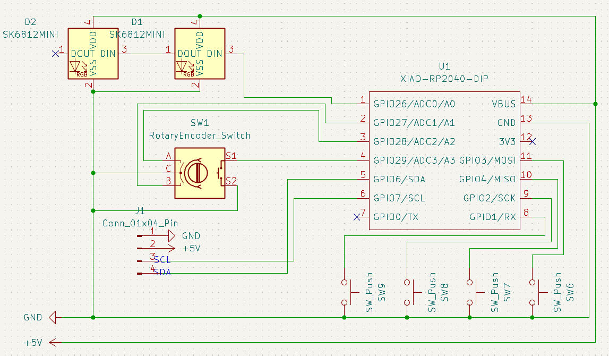
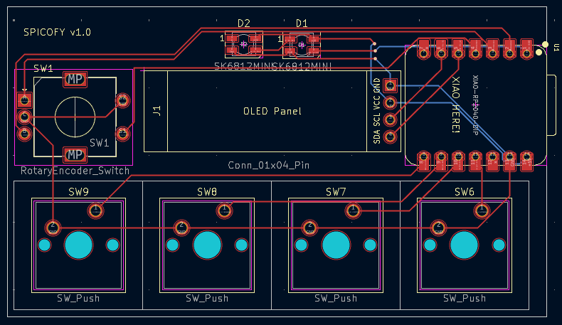
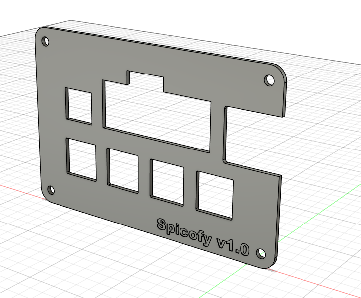

# **Spicofy v1.0**

A spotify controller with features including play, pause and volume control and an OLED Panel to show the currently playing song along with RGB indicators for status.
> Note: Requires Spotify premium as the Web API does not allow changes to playback state without premium!

 

Made as a submission to [hackclub's blueprint](https://blueprint.hackclub.com) with immense help from the [make-your-own-hackpad guide.](https://blueprint.hackclub.com/hackpad)

> *This is my first hardware project! Thank you hackclub for this amazing opportunity!! <3*

[View CAD Files](./v1/CAD/) 
[View PCB Files](./v1/PCB/)

## Components Used (BOM)
- Seeed XIAO RP2040 (1x)
- EC11 Rotary encoder (1x)
- MX-Style switches (4x)
- SSD1306 0.91 inch OLED display (1x)
- SK6812 MINI-E LEDs (2x)

## Firmware

### [*Click here to view Firmware files*](./v1/firmware/)
> Host & MCU specific READMEs are available in their respective folders.

- #### MCU:
    - Drives a 0.91' 128x32 OLED Display using the [SSD1306 driver](https://github.com/adafruit/Adafruit_CircuitPython_DisplayIO_SSD1306) that displays the current playback state.
    - Uses [kmk firmware](https://github.com/KMKfw/kmk_firmware) to detect keypress and rotary encoder events.
    - Listens to data from the serial port for current playback state.
    - Sends data to the serial port for changes in the playback state (play/pause, next, volume etc.)
- #### Host (PC connected via USB-C):
    Responsible for getting the access token from the [Spotify Web API](https://developer.spotify.com/documentation/web-api) and relaying information between the API and the MCU.

## Pictures
> Taken from [Fusion 360](https://www.autodesk.com/products/fusion-360/overview) & [KiCad](https://www.kicad.org/)

> Model Credits (grabcad.com)
> - [cherry-mx-switches](https://grabcad.com/library/cherry-mx-switches-mx-1)
> - [seeed-studio-xiao-rp2040](https://grabcad.com/library/seeed-studio-xiao-rp2040-2)
> - [SSD1306-oled-display](https://grabcad.com/library/display-oled128x32-1)
> - [rotary-encoder](https://grabcad.com/library/rotary-encoder-17)
> - [sk6812mini-e-led](https://grabcad.com/library/sk6812mini-e-led-1)